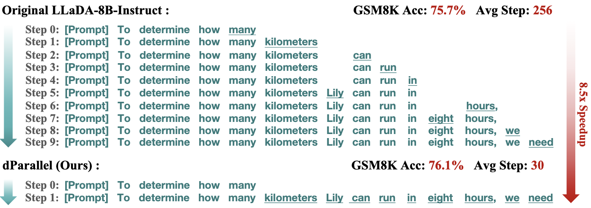
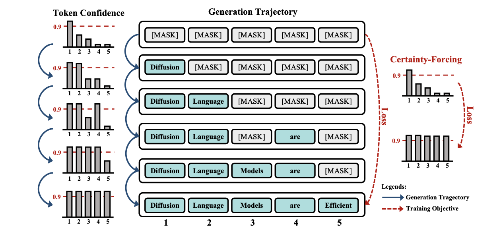
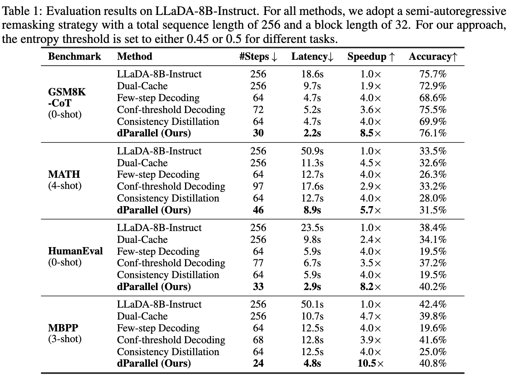
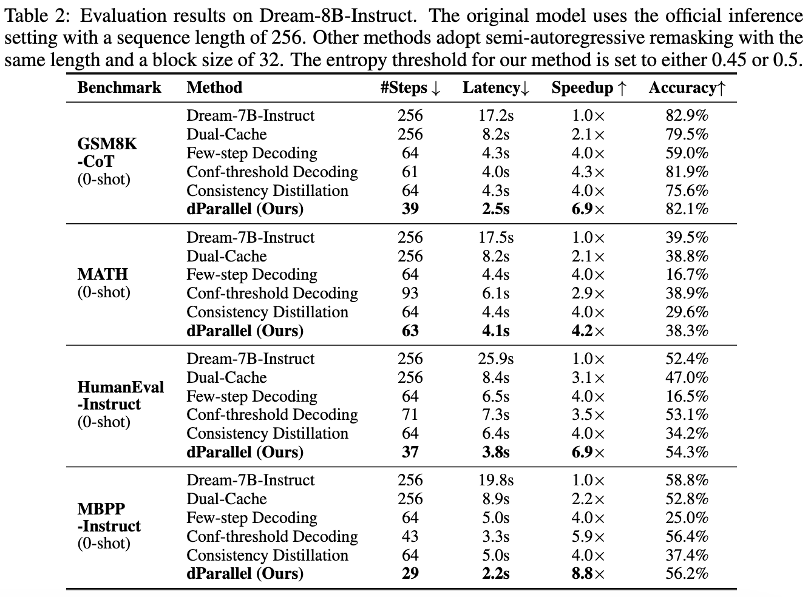
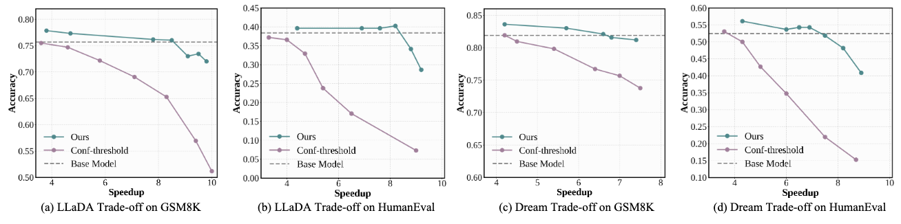

<div align="center">
<h1>🚀 dParallel: Learnable Parallel Decoding for dLLMs</h1>
  <div align="center">
  <a href="https://opensource.org/license/mit-0">
    
  </a>
  <a href="https://arxiv.org/pdf/2509.26488">
    
  </a>
  <a href="https://huggingface.co/Zigeng/dParallel-LLaDA-8B-instruct">
    
  </a>
  </a>
  <a href="https://huggingface.co/Zigeng/dParallel_Dream_7B_Instruct">
    
  </a>
</div>
</div>

https://github.com/user-attachments/assets/89d81255-9cd8-46d1-886e-0733938e5328

> **dParallel: Learnable Parallel Decoding for dLLMs**   
> [Zigeng Chen](https://github.com/czg1225), [Gongfan Fang](https://fangggf.github.io/), [Xinyin Ma](https://horseee.github.io/), [Ruonan Yu](https://scholar.google.com/citations?user=UHP95egAAAAJ&hl=en), [Xinchao Wang](https://sites.google.com/site/sitexinchaowang/)   
> [xML Lab](https://sites.google.com/view/xml-nus), National University of Singapore  


## 💡 Introduction
We introduce dParallel, a simple and effective method that unlocks the inherent parallelism of dLLMs for fast sampling. We identify that the key bottleneck to parallel decoding arises from the sequential certainty convergence for masked tokens. Building on this insight, we introduce the core of our approach: certainty-forcing distillation, a novel training strategy that distills the model to follow its original sampling trajectories while enforcing it to achieve high certainty on masked tokens more rapidly and in parallel. Extensive experiments across various benchmarks demonstrate that our method can dramatically reduce the number of decoding steps while maintaining performance. When applied to the LLaDA-8B-Instruct model, dParallel reduces decoding steps from 256 to 30 on GSM8K, achieving an 8.5× speedup without performance degradation. On the MBPP benchmark, it cuts decoding steps from 256 to 24, resulting in a 10.5× speedup while maintaining accuracy.

<!--  -->
<div align="center">
  </img>
  <br>
  <em>
      Overview of proposed certainty-forcing distillation. 
  </em>
</div>
<br>


## 💻 Model and Datasets
<table>
<table>
  <thead>
  </thead>
  <tbody>
    <tr>
      <td>📄 <strong>Paper</strong></td>
      <td><a href="https://arxiv.org/pdf/2509.26488">ArXiv-Link</a></td>
    </tr>
    <tr>
      <td>🤖 <strong>LLaDA Model</strong></td>
      <td><a href="https://huggingface.co/Zigeng/dParallel-LLaDA-8B-instruct">dParallel-LLaDA-8B-instruct</a></td>
    </tr>
    <tr>
      <td>🤖 <strong>Dream Model</strong></td>
      <td><a href="https://huggingface.co/Zigeng/dParallel_Dream_7B_Instruct">dParallel-Dream-7B-instruct</a></td>
    </tr>
    <tr>
      <td>📊 <strong>LLaDA Data</strong></td>
      <td><a href="https://huggingface.co/datasets/Zigeng/dParallel_LLaDA_Distill_Data">
dParallel-LLaDA-Distill Dataset</a></td>
    </tr>
    <tr>
      <td>📊 <strong>Dream Data</strong></td>
      <td><a href="https://huggingface.co/datasets/Zigeng/dParallel_Dream_Distill_Data">
dParallel-Dream-Distill Dataset</a></td>
    </tr>
  </tbody>
</table>

## 🔥Updates
* 🔥 **[Jan 26, 2026]**: Our paper is accept by ICLR 2026.
* 🔥 **[Oct 1, 2025]**: Our arxiv paper is available.
* 🔥 **[Oct 1, 2025]**: Code, model and dataset are released.

## 🔧  Installation:

```bash
conda create -n dparallel python==3.10
conda activate dparallel
pip3 install -r requirements.txt
```

## 🚀 Quick Start:
```python
# cd LLaDA
from transformers import AutoTokenizer
from model.modeling_llada import LLaDAModelLM
from generate import generate
import torch

device = 'cuda'
model = LLaDAModelLM.from_pretrained('Zigeng/dParallel-LLaDA-8B-instruct', trust_remote_code=True, torch_dtype=torch.bfloat16).to(device).eval()
tokenizer = AutoTokenizer.from_pretrained('Zigeng/dParallel-LLaDA-8B-instruct', trust_remote_code=True)

prompt = "Natalia sold clips to 48 of her friends in April, and then she sold half as many clips in May. How many clips did Natalia sell altogether in April and May? Please reason step by step, and put your final answer within \\boxed{}."

m = [{"role": "user", "content": prompt}, ]
prompt = tokenizer.apply_chat_template(m, add_generation_prompt=True, tokenize=False)

input_ids = tokenizer(prompt)['input_ids']
input_ids = torch.tensor(input_ids).to(device).unsqueeze(0)

out = generate(model, input_ids, steps=256, gen_length=256, block_length=32, temperature=0., threshold=0.5,remasking='low_confidence')
print("Response:",tokenizer.batch_decode(out[0][:, input_ids.shape[1]:], skip_special_tokens=True)[0])
print("NFE:",out[1])
```

## ⚡ Evaluation:
We provide evaluation scripts covering GSM8K, Minerva_MATH, HumanEval, and MBPP benchmarks. Importantly, both our reported results and the accompanying code are obtained without using caching or sparse attention techniques. Nevertheless, our method is fully compatible with these optimizations, and integrating them can yield even greater speedups.

For dParallel LLaDA Evaluation:
```bash
cd LLaDA
sh eval.sh
```

For dParallel Dream Evaluation:
```bash
cd Dream/eval_instruct
sh eval.sh
```

## 🔥 Training
### 1. Certainty-Forcing Distillation with LoRA:
We provide training scripts for our proposed Certainty-Forcing Distillation process. The implementation utilizes LoRA during the training process, with the configuration details specified in [config_lora_llada.yaml](https://github.com/czg1225/dParallel/blob/master/LLaDA/configs/config_lora_llada.yaml) and [config_lora_dream.yaml](https://github.com/czg1225/dParallel/blob/master/Dream/configs/config_lora_dream.yaml). The training can be completed with 24 GB memory GPUs.

For LLaDA Distillation:
```python
cd LLaDA
deepspeed --master_port 29501 --include localhost:0,1,2,3,4,5,6,7 llada_train.py
```

For Dream Distillation:
```python
cd Dream
deepspeed --master_port 29501 --include localhost:0,1,2,3,4,5,6,7 dream_train.py
```

### 2. LoRA Merge:
After training, merge the LoRA weights to get the dParallel-dLLM.

For LLaDA Model:
```python
cd LLaDA
python merge_lora.py
```
For Dream Model:
```python
cd Dream
python merge_lora.py
```


## 📖 Experimental Results
### Results on LLaDA-8B-Instruct:


### Results on Dream-7B-Instruct:


### Better Speed-Accuracy Trade-off:


## ☀️ Acknowledgement
Our code builds on [LLaDA](https://github.com/ML-GSAI/LLaDA), [Dream](https://github.com/DreamLM/Dream), [Fast-dLLM](https://github.com/NVlabs/Fast-dLLM/tree/main), and [dKV-Cache](https://github.com/horseee/dkv-cache), and we acknowledge these great works for laying the groundwork that made our approach possible.

## Citation
If our research assists your work, please give us a star ⭐ or cite us using:
```
@article{chen2025dparallel,
  title={dParallel: Learnable Parallel Decoding for dLLMs},
  author={Chen, Zigeng and Fang, Gongfan and Ma, Xinyin and Yu, Ruonan and Wang, Xinchao},
  journal={arXiv preprint arXiv:2509.26488},
  year={2025}
}
```
